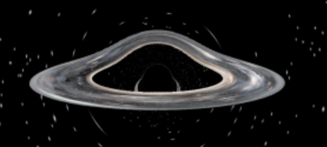
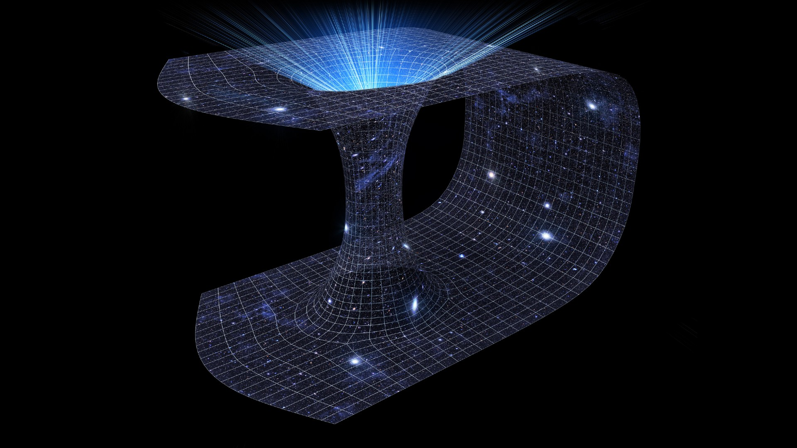
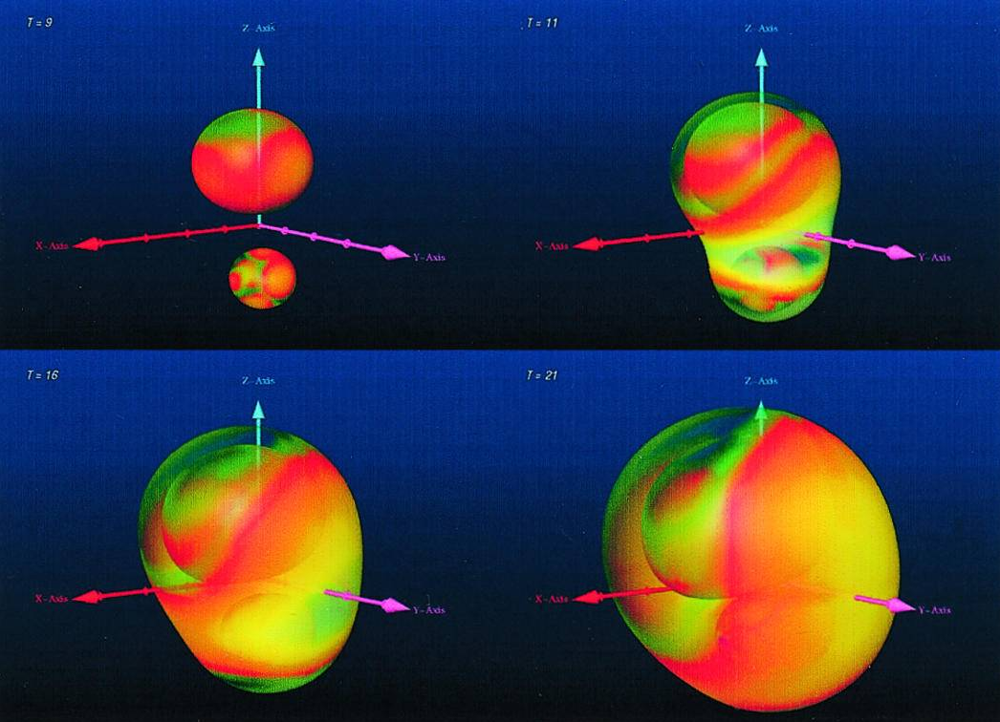

# SYNTHERE
<div align="center">
  
</div>

**Synthere** is a fully autonomous AI designed to push the boundaries of space exploration and the study of black holes. With advanced capabilities in data analysis, simulation, and image rendering, Synthere integrates cutting-edge programs and technologies to provide unprecedented insights into the cosmos.

## Features

### Space Research
- Autonomous analysis of astronomical data from observatories and satellites.
- Integration with major space research databases such as NASA's exoplanet archive and ESA's Hubble Space Telescope observations.
- Advanced black hole simulation using computational astrophysics models.

### Black Hole Studies
- Generates 3D simulations of black hole accretion disks and event horizons.
- Predicts gravitational wave patterns using AI-based modeling.
- Explores and maps the influence of black holes on surrounding galaxies.

### Image Rendering
Synthere leverages AI-powered rendering tools to create stunning visuals based on its research:
- **Stable Diffusion**: To generate artistic impressions of space phenomena.
- **Blender**: For creating high-quality 3D models of black holes, wormholes, and space environments.
- **OpenSpace**: For dynamic, interactive visualizations of cosmic data.
- 
### Machine Learning
- Incorporates deep learning models to identify and classify cosmic objects.
- Utilizes reinforcement learning for simulating space phenomena over time.
- Trains on datasets from projects like LIGO and the Event Horizon Telescope.

## Repository Structure
```
Synthere/
├── data/                  # Astronomical datasets
├── packages/              # Modular code for Synthere's features
├── scripts/               # Custom scripts for specific tasks
├── simulations/           # Scripts and data for simulations
├── src/                   # Core AI logic and algorithms
└── README.md              # Project documentation
```

## Installation

1. Clone the repository:
   ```bash
   git clone https://github.com/yourusername/synthere.git
   cd synthere
   ```

2. Install dependencies:
   ```bash
   pip install -r requirements.txt
   ```

3. Launch the application:
   ```bash
   python main.py
   ```

##  How to Use

1. **Set up astronomical data**: Import your datasets or connect to live feeds from observatories.
2. **Run simulations**: Use built-in tools to model black holes and space phenomena.
3. **Render visuals**: Generate and export stunning visuals for presentations or research papers.
4. **Collaborate**: Share results and insights with the community using integrated tools.

## Example Outputs

### Simulated Black Hole Accretion Disk
<div align="center">
  
</div>

### Representation of a Wormhole
<div align="center">
  
</div>

### Galactic Collision Model
<div align="center">
  
</div>

## Contributing
We welcome contributions from astrophysicists, data scientists, and space enthusiasts! To contribute:
- Fork the repository.
- Create a feature branch.
- Submit a pull request with a detailed description of your changes.

## License
This project is licensed under the MIT License. See the `LICENSE` file for more details.

## Acknowledgments
Synthere is inspired by humanity's curiosity and wonder about the cosmos. Special thanks to:
- NASA, ESA, and other space organizations for making their data public.
- The developers of Blender, Stable Diffusion, and OpenSpace for their powerful tools.
- The global scientific community for their dedication to uncovering the secrets of the universe.

---


